# 🚀 TerraOrbit

**An end-to-end AWS Infrastructure-as-Code project built for the TrainWithShubham #TerraWeek Challenge (July 12–17, 2026).**

TerraOrbit provisions a complete, production-style AWS environment using Terraform — a custom VPC, a live Nginx web server, S3 storage, remote state with locking, reusable modules, multi-region provider aliasing, environment workspaces, and a GitHub Actions CI/CD pipeline. Built day-by-day across the 7-day challenge, one Terraform concept at a time, on an AWS Free Tier account.

> Built for the **TrainWithShubham #TerraWeek Challenge**

📺 Demo Project Video

Watch the full project demo here: https://youtu.be/lM-zPxM4NDM?si=vUUU-eTcLvJWvQb9
---

## 📐 Project Architecture

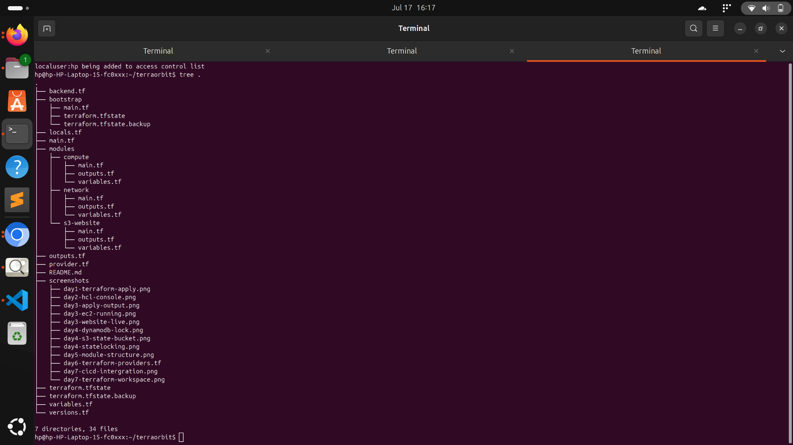

- Custom **VPC** (`10.0.0.0/16`) across 2 Availability Zones
- **2 public + 2 private subnets**, Internet Gateway, route tables
- **EC2 (t2.micro)** running Nginx, serving a live styled landing page
- **Security Group** restricting SSH to my IP, HTTP open to all
- **S3 bucket** for static assets (versioned, unique name via `random_id`)
- **Remote state** in S3 + **DynamoDB** table for state locking
- Code organized into **modules**: `network`, `compute`, `s3-website`
- **AWS + random providers**, version-pinned (`versions.tf`), with a secondary region alias
- **Workspaces**: `dev`, `stage`, `prod`
- **CI/CD**: GitHub Actions runs `fmt → validate → plan → apply`

All resources used are **AWS Free Tier eligible**.

---

## 🛠️ Prerequisites

- AWS account (Free Tier) with an IAM user (programmatic access)
- Terraform >= 1.7.0
- AWS CLI v2, configured via `aws configure`
- Git + GitHub account

---

## 📅 Day-by-Day Build Log

### Day 1 (Sunday) — Introduction to Terraform
**Focus:** IaC basics, environment setup, first apply.

- Installed Terraform + AWS CLI, configured credentials with `aws configure`
- Initialized project repo (`terraorbit`) and `.gitignore`
- Wrote `provider.tf` to configure the AWS provider (`ap-south-1` — Mumbai)
- Added a `data "aws_caller_identity"` block + output to verify AWS connectivity
- Ran `terraform init`, `plan`, `apply` for the first time and confirmed the account ID printed correctly

**Files added:** `provider.tf`, `main.tf`, `outputs.tf`

📸 **Screenshot:**
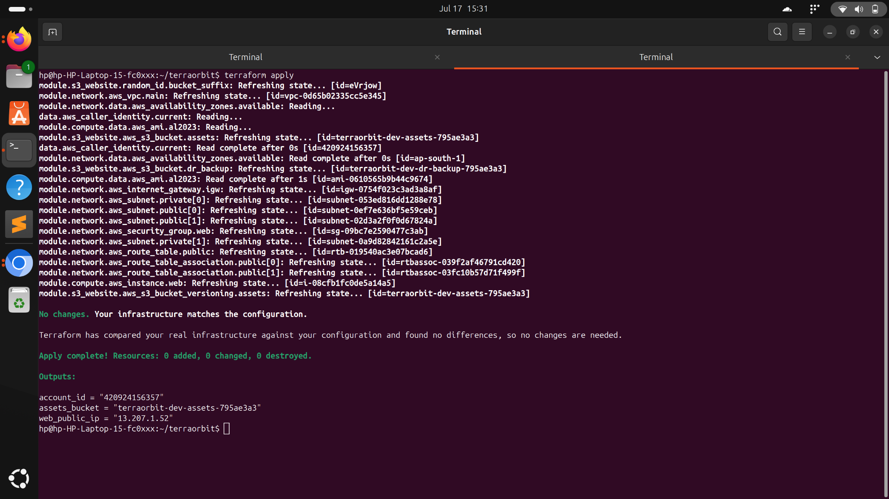

---

### Day 2 (Monday) — Terraform Configuration Language (HCL)
**Focus:** Variables, data types, expressions.

- Created `variables.tf` with strings, lists, and maps (`project_name`, `vpc_cidr`, `public_subnet_cidrs`, `extra_tags`, etc.)
- Created `locals.tf` with a `merge()`-based common tagging strategy, string interpolation (`name_prefix`), and a conditional expression (`is_prod`)
- Practiced `for` expressions and local values interactively in `terraform console`
- Adopted `terraform fmt` + `terraform validate` as a daily habit

**Files added:** `variables.tf`, `locals.tf`

📸 **Screenshot:**
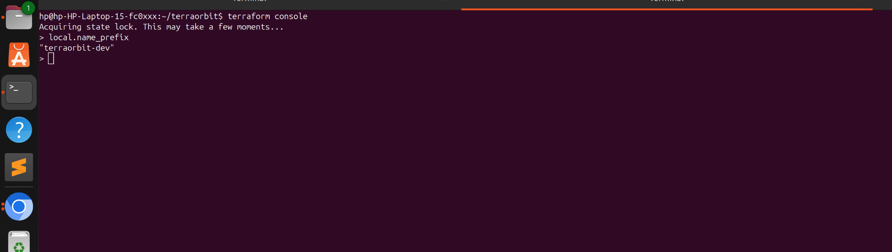

---

### Day 3 (Tuesday) — Managing Resources
**Focus:** Real infrastructure — networking + compute.

- Built the **VPC**, **Internet Gateway**, 2 public + 2 private **subnets**, and a **public route table** with associations
- Added a **Security Group** (SSH restricted to my IP, HTTP open) with a `lifecycle { create_before_destroy = true }` rule
- Provisioned an **EC2 instance** (latest Amazon Linux 2023 AMI via `data "aws_ami"`) with a `user_data` script installing and starting **Nginx**, serving a styled TerraOrbit landing page
- Used `depends_on` to guarantee the route table exists before the instance boots
- Verified the server live in the browser and via `curl http://<public_ip>`

**Files added:** `network.tf`, `security.tf`, `compute.tf`

📸 **Screenshots:**
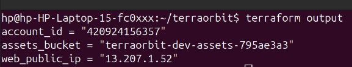
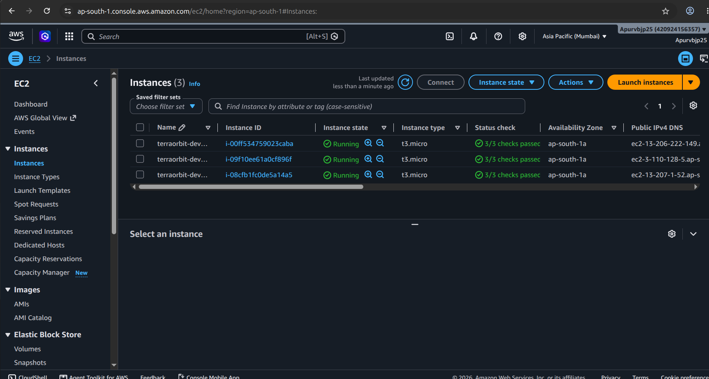
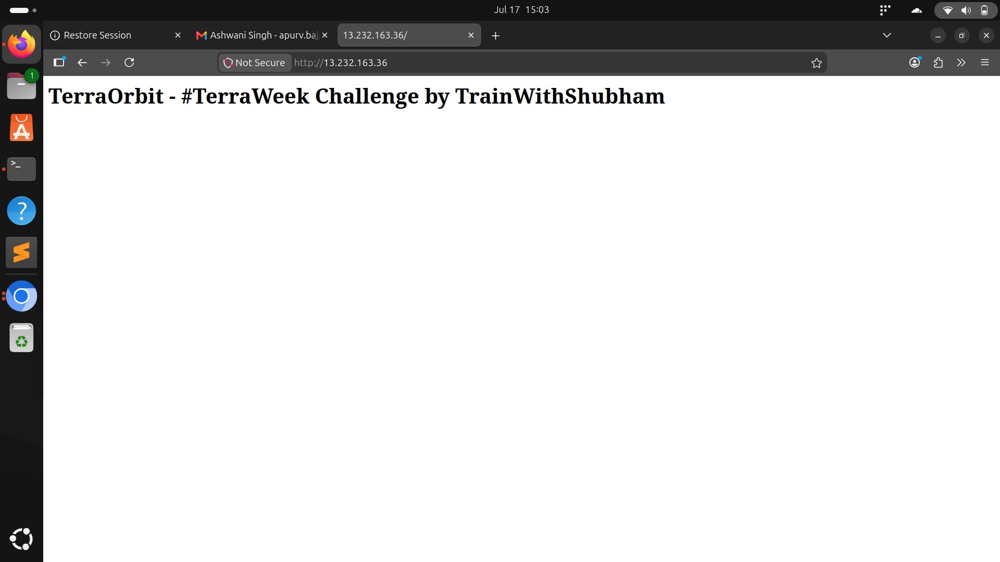

---

### Day 4 (Wednesday) — Terraform State Management
**Focus:** Moving from local to remote, locked state.

- Bootstrapped a separate `bootstrap/` config to create an **S3 bucket** (versioned, unique via `random_id`) and a **DynamoDB table** for locking
- Added `backend.tf` in the main project pointing to that S3 bucket + DynamoDB table
- Migrated local state to remote: `terraform init -migrate-state`
- Practiced `terraform state list`, `state show`, `state mv`
- Verified state locking by running `terraform plan` in two terminals simultaneously — second run correctly waited on/errored with a lock

**Files added:** `bootstrap/main.tf`, `backend.tf`

📸 **Screenshots:**
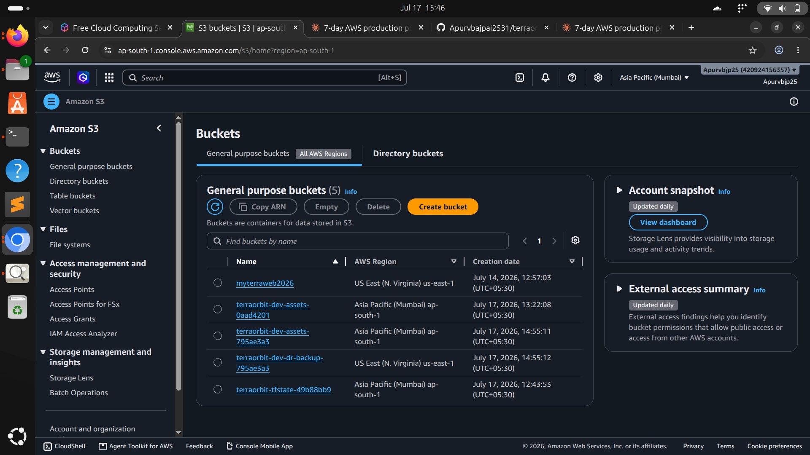
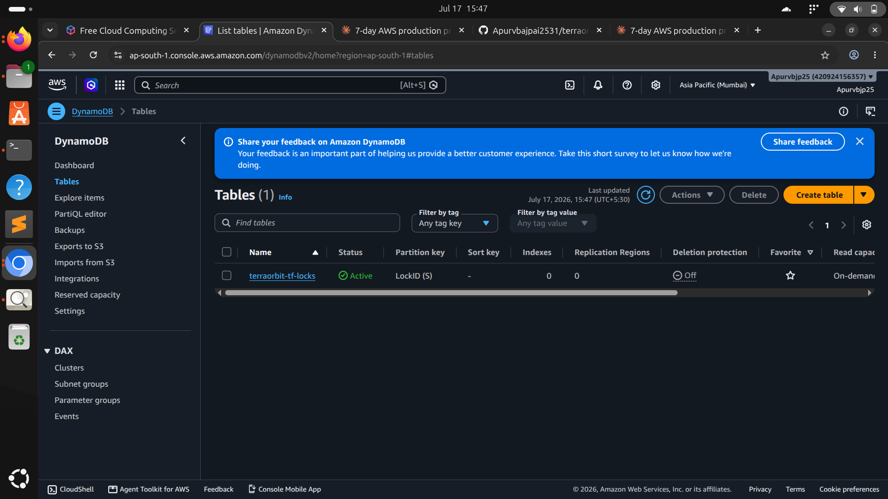
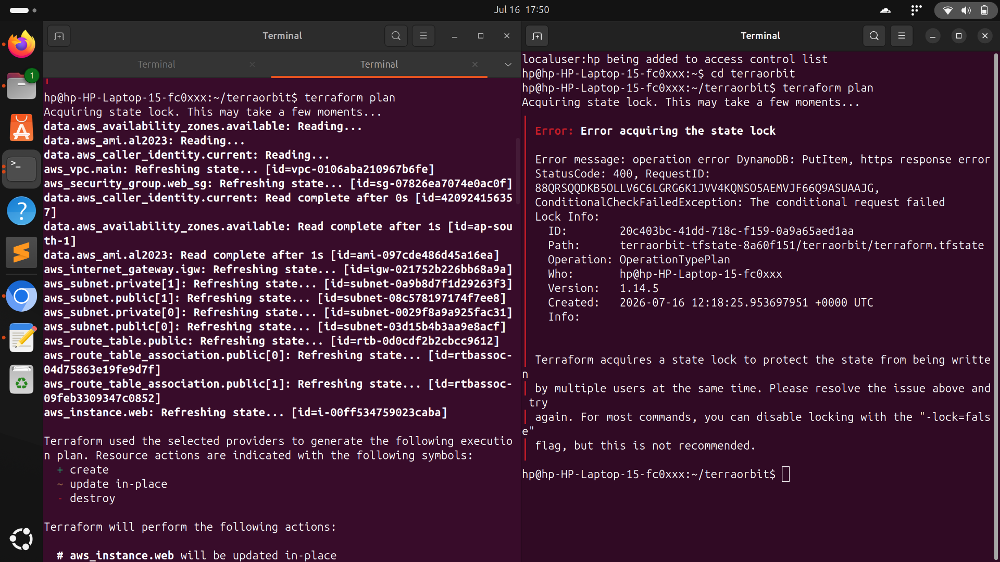

---

### Day 5 (Thursday) — Terraform Modules
**Focus:** Reusable, composable infrastructure.

- Refactored Day 3's flat resources into three modules:
  - `modules/network` — VPC, subnets, IGW, route table, security group
  - `modules/compute` — EC2 instance
  - `modules/s3-website` — versioned S3 bucket for static assets
- Rebuilt the root `main.tf` to call each module and wire outputs between them (e.g., `module.network.public_subnet_ids[0]` feeds `module.compute`)
- Noted the path to module versioning: pinning a module source to a Git tag (`?ref=v1.0.0`) once stable

**Files added:** `modules/network/*`, `modules/compute/*`, `modules/s3-website/*`

📸 **Screenshot:**
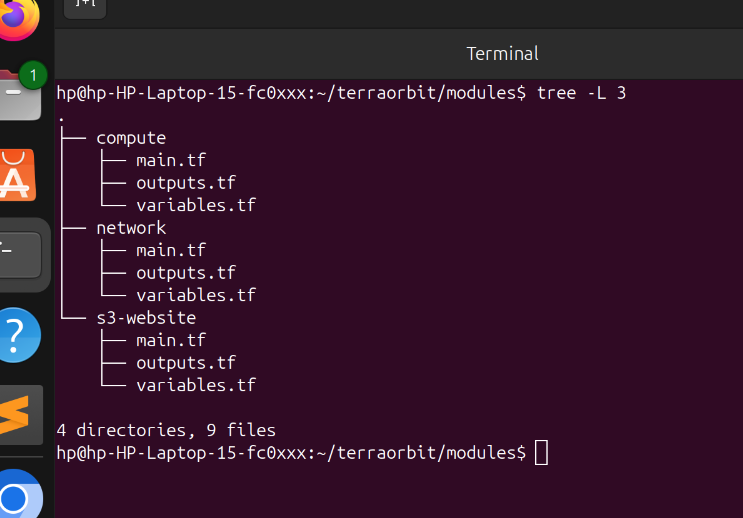

---

### Day 6 (Friday, Part 1) — Terraform Providers
**Focus:** Provider configuration, versioning, authentication.

- Added `versions.tf` pinning `hashicorp/aws ~> 5.0` and `hashicorp/random ~> 3.6`
- Added a second, **aliased AWS provider** (`alias = "dr"`) targeting `us-east-1` for future multi-region use
- Used the `random` provider to generate globally-unique S3 bucket suffixes instead of hardcoding names
- Verified provider wiring with `terraform providers`

**Files added:** `versions.tf`, updated `provider.tf`

📸 **Screenshot:**
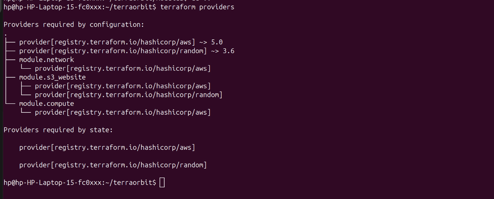

---

### Day 7 (Friday, Part 2) — Advanced Terraform Topics
**Focus:** Workspaces, remote execution, collaboration, best practices.

- Created **`dev`**, **`stage`**, and **`prod`** workspaces (`terraform workspace new`)
- Updated `local.name_prefix` to use `terraform.workspace` so environments never collide
- Built a **GitHub Actions** pipeline (`.github/workflows/terraform.yml`) that runs `fmt`, `validate`, and `plan` on every PR, and `apply` automatically on merge to `main`
- Stored AWS credentials as encrypted GitHub Actions secrets
- Fixed CI issues along the way: committed `.terraform.lock.hcl` for consistent provider versions across machines, selected the correct workspace inside CI, and resolved unused-declaration `tflint` warnings
- Finalized formatting, validation, and documentation

**Files added:** `.github/workflows/terraform.yml`, this `README.md`

📸 **Screenshots:**
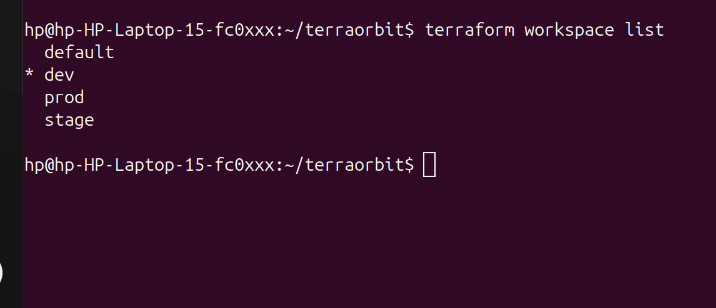
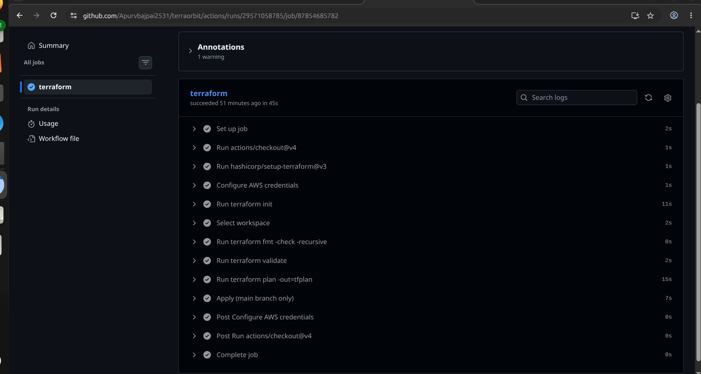

---

## 🧹 Cleanup

To avoid any AWS charges after the challenge/judging is complete:

```bash
terraform workspace select dev   && terraform destroy -auto-approve
terraform workspace select stage && terraform destroy -auto-approve
terraform workspace select prod  && terraform destroy -auto-approve

cd bootstrap && terraform destroy -auto-approve
```

---

---

Built with ❤️ and Terraform for **TrainWithShubham #TerraWeek Challenge**.
